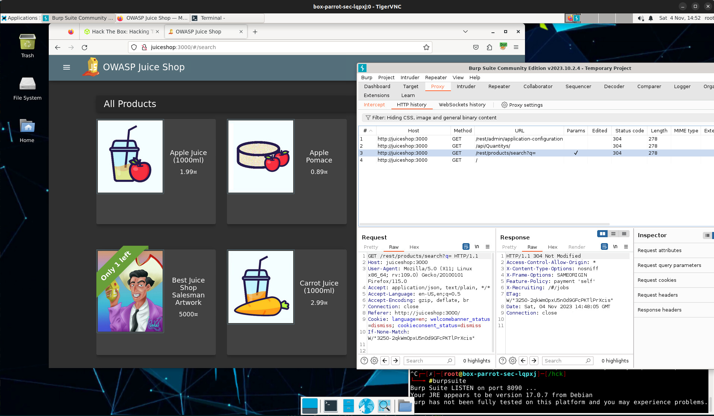
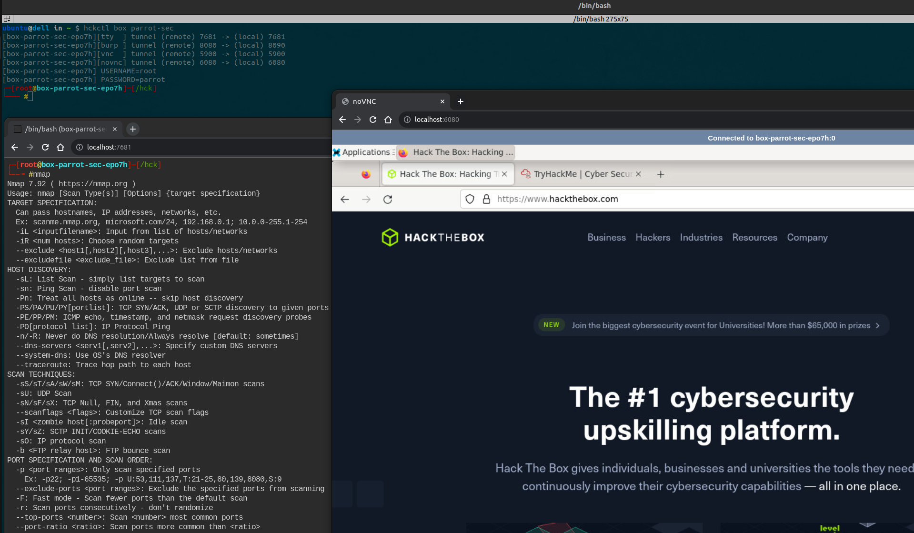

<p align="center">
  
</p>

<h1 align="center"><code>hckctl</code></h1>

<p align="center">
  <a href="https://github.com/hckops/hckctl/actions/workflows/ci.yml">
    
  </a>
  <a href="https://github.com/hckops/hckctl/actions/workflows/release.yml">
    
  </a>
  <a href="https://pkg.go.dev/github.com/hckops/hckctl">
    
  </a>
  <a href="https://discord.gg/4PYPV9qP27">
    
  </a>
</p>

<p align="center">
  <i>The Security Automation Toolkit</i><br>
  <a href="#quick-start">Quick start</a>&nbsp;&bull;
  <a href="#provider">Provider</a>&nbsp;&bull;
  <a href="#setup">Setup</a>&nbsp;&bull;
  <a href="#development">Development</a>&nbsp;&bull;
  <a href="#roadmap">Roadmap</a>&nbsp;&bull;
  <a href="#contribute">Contribute</a>
</p>
<br>

Launch manual and automated attacks with pre-defined and always up-to-date templates of your favourite tools.

Attack a vulnerable infrastructure and connect to your training platform ([HTB](https://www.hackthebox.com), [TryHackMe](https://tryhackme.com), [Vulnlab](https://www.vulnlab.com), etc.) without wasting anymore time on boring installations, environment setup and network configurations.

Package, distribute and run local or remote boxes and workflows to find weaknesses on authorized targets in a declarative way. `hckctl` is free, open source and community driven, no vendor lock-in, extensible and built using native providers api.

## Quick start

### Box

Spin-up a [`box`](https://github.com/hckops/megalopolis/tree/main/box) and access all port-forwarded ports locally
```bash
# spawns a temporary docker box locally
hckctl box alpine
#[box-alpine-<RANDOM>][tty] tunnel (remote) 7681 -> (local) 7681
#[box-alpine-<RANDOM>] TTYD_USERNAME=root
#[box-alpine-<RANDOM>] TTYD_PASSWORD=alpine

# deploys a detached box to a kubernetes cluster
hckctl box start arch --provider kube
# tunnels tty port only
hckctl box open box-arch-<RANDOM> --no-exec

# creates a pwnbox box connected to your hack the box account
hckctl box preview/parrot-sec --network-vpn htb
# connects to vnc
vncviewer localhost:5900

# starts a background box to attack locally
hckctl box start vulnerable/owasp-juice-shop
```

*parrot-sec box screenshots*

</img>
</img>

### Task

Run a single-stage [`task`](https://github.com/hckops/megalopolis/tree/main/task) using pre-defined commands
```bash
# shows the "help" command
hckctl task nuclei --command help

# uses the "default" preset command and arguments
hckctl task rustscan
# equivalent of
hckctl task rustscan --input address=127.0.0.1
hckctl task scanner/rustscan --command default --input address=127.0.0.1

# runs the "full" preset command against the retired "Lame" machine (with docker)
# see https://app.hackthebox.com/machines/Lame
hckctl task nmap --network-vpn htb --command full --input address=10.10.10.3 
# equivalent of (with kube)
hckctl task nmap --network-vpn htb --provider kube --inline -- nmap 10.10.10.3 -sC -sV

# downloads common wordlists
git clone --depth 1 https://github.com/danielmiessler/SecLists.git \
  ${HOME}/.local/state/hck/share/wordlists/SecLists
# fuzzing using a local template against the retired "Knife" machine (with kube)
# see https://app.hackthebox.com/machines/Knife
hckctl task \
  --local ../megalopolis/task/fuzzer/gobuster.yml \
  --network-vpn htb \
  --provider kube \
  --input address=10.10.10.242 \
  --input wordlist=wordlists/SecLists/Discovery/Web-Content/Apache.fuzz.txt

# monitors the logs
tail -F ${HOME}/.local/state/hck/task/log/task-*
```

Output command [examples](docs/task-htb-example.txt)

### Template

Explore all available templates or write your own and validate it locally
```bash
# lists all templates
hckctl template list

# validates all templates
hckctl template validate "../megalopolis/**/*.{yml,yaml}"
```

The whole project is centered around git as source of truth, schema validation and versioning. Pin a `revision` (branch, tag, or sha) if you need to ensure long term stability
```bash
# uses template "megalopolis/task/scanner/trivy" @ commit hash "12e7599"
hckctl task trivy --revision v0.1.0
```

### Config

Override the default configurations
```bash
# prints path and current configs
hckctl config

# resets default configs
hckctl config --reset
```

How to configure vpn networks
```bash
# edits config file
vim ${HOME}/.config/hck/config.yml

# example
network:
  vpn:
  - name: htb
    path: /home/demo/ctf/openvpn/htb_demo_eu_vip_28.ovpn
  - name: thm
    path: /home/demo/ctf/openvpn/thm_demo_us_regular_3.ovpn
```

## Provider

### Docker

Follow the official [instructions](https://docs.docker.com/engine/install) to install Docker Engine. The fastest way to get started on Linux is with the [convenience script](https://get.docker.com)
```bash
# downloads and runs script
curl -fsSL https://get.docker.com -o get-docker.sh
./sudo sh get-docker.sh
```
or on macOS with [Docker Desktop](https://docs.docker.com/desktop)
```bash
brew install homebrew/cask/docker
```

[lazydocker](https://github.com/jesseduffield/lazydocker) is the recommended tool to watch and monitor containers

### Kubernetes

#### Remote

If you are looking for a simple and cheap way to get started with a *remote* cluster use [kube-template](https://github.com/hckops/kube-template) on [DigitalOcean](https://www.digitalocean.com/products/kubernetes)
```bash
provider:
  kube:
    configPath: "/PATH/TO/kube-template/clusters/do-template-kubeconfig.yaml"
```

#### Local

Use [minikube](https://minikube.sigs.k8s.io), [kind](https://kind.sigs.k8s.io) or [k3s](https://k3s.io) to setup a local cluster
```bash
provider:
  kube:
    # absolute path, empty by default uses "${HOME}/.kube/config"
    configPath: ""
    namespace: hckops
```

#### Troubleshooting

Useful dev tools, see [`hckops/kube-base`](https://github.com/hckops/actions/blob/main/docker/Dockerfile.base)
```bash
# starts tmp container
docker run --rm --name hck-tmp-local --network host -it \
  -v ${HOME}/.kube/config:/root/.kube/config hckops/kube-base

# watches pods
kubectl klock -n hckops pods
```

Depending on your local environment, you might need to override IPv6 config in the *local* cluster to use the `--network-vpn` flag. Set also `--embed-certs` if you need to use the dev tools
```bash
# starts local cluster
minikube start --embed-certs \
  --extra-config="kubelet.allowed-unsafe-sysctls=net.ipv6.conf.all.disable_ipv6"

# runs with temporary privileges to connect to a vpn
env HCK_CONFIG_NETWORK.PRIVILEGED=true hckctl box alpine --provider kube --network-vpn htb
# equivalent of
network:
  # default is false, override for local clusters
  privileged: true
```

### Cloud

Access to the platform is limited and in ***private preview***. If you are interested, please leave a comment or a :thumbsup: to this [issue](https://github.com/hckops/hckctl/issues/104) and we'll reach out with more details
```bash
provider:
  cloud:
    host: <ADDRESS>
    port: 2222
    username: <USERNAME>
    token: <TOKEN>
```

### Podman (coming soon)

Follow the official [instructions](https://podman.io/docs/installation) to install Podman

## Setup

### Linux

```bash
# latest release
HCKCTL_VERSION=$(curl -sS https://api.github.com/repos/hckops/hckctl/releases/latest | jq -r .tag_name)

# install or update
curl -sSL https://github.com/hckops/hckctl/releases/latest/download/hckctl-${HCKCTL_VERSION#"v"}-linux-x86_64.tar.gz | \
  sudo tar -xzf - -C /usr/local/bin

# verify
hckctl version

# uninstall
sudo rm /usr/local/bin/hckctl
```

### MacOS

* [Homebrew](https://brew.sh)

```bash
# install
brew install hckops/tap/hckctl

# update
brew upgrade hckctl
```

## Development

* [just](https://github.com/casey/just)

```bash
# run
go run internal/main.go

# debug
go run internal/main.go task test/debug --provider kube --inline -- tree /hck/share

# build
just
./build/hckctl

# logs
tail -F ${HOME}/.local/state/hck/log/hckctl-*.log

# publish (without "v" prefix)
just publish <MAJOR.MINOR.PATCH>
```

## Roadmap

* `flow` orchestrate and schedule multistage tasks, collect and output the combined results in multiple formats
* `lab` simulate attacks and scenarios against vulnerable targets on a managed platform
* `machine` create and access VMs e.g. DigitalOcean Droplet, AWS EC2, Azure Virtual Machines, QEMU etc.
* `tui` similar to lazydocker and k9s together
* `network` support WireGuard, Tor, ProxyChains, etc.
* `plugin` add custom cli commands in any language
  - `man` combine tldr and cheat with task commands
  - `htb` and `thm` api to start/stop/list machines and submit flags
  - `mitm` hook to intercept network traffic of boxes and tasks
  - `prompt` ChatGPT prompt style

## Contribute

Create your custom template and test it locally
```bash
# loads local template
hckctl box --local ../megalopolis/box/preview/powershell.yml
```

Please, feel free to contribute to the companion [repository](https://github.com/hckops/megalopolis) and add more community templates to the catalog.
Credit should go to all the authors and maintainers for their open source tools, without them this project wouldn't exist!

<!--

* review sec-notes
* demo
    - play htb/thm/root-me (unix and windows)
    - strawhatsec link with "megalopolis/box/vulnerable" solution
    - example auto-exploitation box with `htb-postman` > TODO listen port
    - create PR to external official doc to run
        * owasp/dvwa
        * add "how to setup" e.g. https://github.com/juice-shop/juice-shop#docker-container
        * https://github.com/vulhub/vulhub
        * https://houdini.secsi.io
* general
    - convert TODOs left in GitHub issues
    - add GitHub org labels: feature/bug/question
    - add disclaimer of responsibility to readme?
    - review context/http/client timeouts e.g. vpn or target not available
    - add readme lab video/gif https://asciinema.org
    - delete old branches (video)
    - review/delete GitHub project
    - update internal cli diagram
    - docker: add support for remote docker daemon with `DOCKER_HOST` i.e. dind
    - IMPORTANT docker: to use localhost tunnels with tasks add `--network-host` flag
* cli
    - review all commands cli example/description
    - autocomplete commands and values
        * e.g. `box connect <list of boxes>` with `ValidArgsFunction`
        * e.g. `box <list of box templates>` with `ValidArgsFunction`
        * see fix autocomplete
    - config: add set command
    - config: add migration strategy between versions
    - add confirmation before
        * reset config
        * delete all
    - add copyTo/copyFrom box/task
    - cmd aliases e.g. start/up/create
* template
    - strict schema validation
    - add `--remote` mutually exclusive flag
    - add filters and review output e.g. print table
    - always review and keep up-to-date directories to exclude in `resolvePath` e.g. charts
    - rename `template` to catalog? or alias?
* box
    - BUG docker: support box/preview/powershell.yml `/usr/bin/pwsh` (attach with no tty and raw terminal) see `docker run --rm -it mcr.microsoft.com/powershell`
    - BUG cloud: `execBox` does not interrupt stream with shell none and hang forever
    - on connect/exec with docker/kube print/event shared directory, same as envs, ports etc.
    - add parameter to override default SIZE i.e. s/m/l/xl
    - fix linux `host.docker.internal` e.g. `hckops.local`
    - review tty resize support
    - kube: verify if `close()` is needed or delete and `return nil`
    - kube: `execBox` deployment always check/scale replica to 1 before exec (test with replica=0)
    - list boxes in table with padding see `tabwriter` https://gosamples.dev/string-padding
    - filter/list box (list and delete) and template (list and validate) columns by provider + sorting
    - add flag `--offline` to avoid pulling the latest image (or fail if it doesn't exist)
* lab 
    - TODO add missing `command` cli description and example
    - add inputs override e.g. `--input alias=parrot --input password=changeme --input vpn=htb-eu`
    - inputs should look for HCK_LAB_??? env var override if --input is not present before using default
    - verify optional merge/overrides
    - in `connect` merge/expand BoxEnv actual BoxEnv e.g. generated password
    - compose/template/infra https://kompose.io or https://helm.sh
        * https://github.com/SpecterOps/BloodHound/blob/main/examples/docker-compose/docker-compose.yml
        * https://github.com/digininja/DVWA/blob/master/compose.yml
        * https://github.com/vulhub/vulhub
        * https://github.com/madhuakula/kubernetes-goat.git
* task
    - TODO add missing `command` cli description and example
    - BUG move docker/ContainerCreate and kube/JobCreate `InterruptHandler` in the commands
    - inputs should look for HCK_TASK_??? env var override if --input is not present before using default
    - review TaskV1 schema i.e. `pages`, `license`, command `description` and generate static site
    - docker/kube: limit default resources
    - log: `history` command to list old tasks i.e. names of log files e.g. <TIMESTAMP>-task-<NAME>-<RANDOM>
    - log: for debug purposes prepend file output with interpolated task (yaml) or command parameters + sha REVISION
    - log: add command to remove/clear all logs
    - log: skip output file creation for `help` and `version` commands (set in schema or default commands if always present)
    - log: add `--background` to omit stdout and ignore interrupt handler i.e. only output file
    - add ENV to schema e.g. RUST_LOG=debug
    - add `init` command e.g. update /etc/hosts
* cloud
    - update platform dependency prs (3)
    - verify network connectivity between boxes/tasks i.e. kube.svc
    - add task provider (kube) > vpn use flow?
    - add flow example
    - use public pkg
    - on connect/exec print public endpoints, same as envs, ports etc.
    - use ssh key auth only instead of token + remove InsecureIgnoreHostKey
    - remove body from empty request `omitempty to remove "body":{}`
* version
    - print if new version available
    - implement server and providers `version` in json format docker/kube/cloud
* release
    - goreleaser: add docker release and gh-action (cicd)
    - goreleaser: add scoop
    - test mac and mac1
    - test window vm
    - verify release workflow should depend on ci workflow
    - publish to public/official brew
* megalopolis
    - mirror: https://gitlab.com/hckops
    - docker: tor/browser
    - docker: windows-core
    - docker: kali-core + vnc
    - add command to use generic metasploit plugin
    - https://github.com/D3vil0p3r/htb-toolkit
* prompt
    - https://github.com/snwfdhmp/awesome-gpt-prompt-engineering
    - https://learnprompting.org
* warnings to investigate

# caused by async events
zerolog: could not write event: write /home/<REDACTED>/.local/state/hck/log/hckctl-<REDACTED>.log: file already closed

# cloud only
box remote kube: after killing vnc/portforward
E1020 19:55:12.436966  149063 portforward.go:381] error copying from remote stream to local connection: readfrom tcp4 127.0.0.1:5900->127.0.0.1:54768: write tcp4 127.0.0.1:5900->127.0.0.1:54768: write: broken pipe

https://github.com/ticarpi/dockerauto/issues/1
https://github.com/evilsocket/legba/issues/24
https://github.com/Athena-OS/athena-iso/issues/83
https://github.com/pwnpad/pwnpad/issues/12

-->
